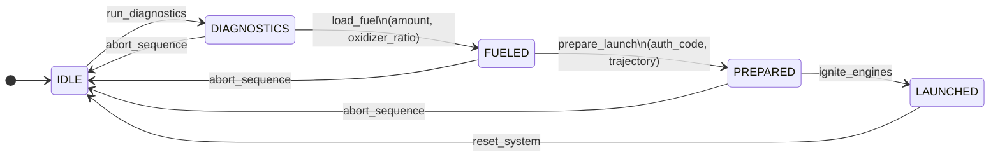

Imagine a scenario where a user asks their AI agent to "LGTM this contribution" on a code review page. While the page exposes a WebMCP `approve_contribution` tool, this action first requires the user to be signed in. Assuming a `sign_in` tool is also available, how should developers design and expose these tools so the agent understands the strict dependency between them?

This illustrates a common challenge in agentic interfaces: when a requested task requires a sequence of state-dependent actions. When tool **A** can only be executed if the application is in state **X** (and state **X** can be reached by executing tool **B**), developers must carefully consider how to communicate these prerequisites to the model to ensure reliable execution.

Currently, there are two primary patterns to solve this problem:

### Static Tool Registration
In this approach, all available tools are registered up-front during initialization. The burden of enforcing state dependencies is placed heavily on the prompt and the LLM itself. Developers must write detailed tool descriptions explaining when each tool is valid, implement explicit state-introspection tools (so the agent can check its current context), and ensure that out-of-turn tool calls return descriptive error messages that guide the LLM back to the correct sequence.

### Dynamic Tool Registration
In this approach, the application's real-time state dictates tool availability. Only the tools valid for the *current* state are registered. As the state changes, the application dynamically unregisters tools that are no longer valid and registers newly unlocked ones. The LLM's context window naturally restricts it to only permissible actions, significantly simplifying tool descriptions and eliminating the need to explicitly document complex prerequisites.

## Case Study - launching rockets to space

To illustrate these concepts, consider the [WebMCP Rocket Launcher](https://github.com/GoogleChromeLabs/webmcp-tools/tree/main/demos/webmcp-rocketlauncher) application. This browser-based demo simulates a rocket launch control panel. An AI agent is tasked with interacting with the panel by calling WebMCP tools to progress a rocket through a strict sequence of lifecycle states.

The system's state machine is defined as follows:

Launching the rocket requires strictly following this chain: running diagnostics, loading propellant, preparing the system (which requires an authorization code), and finally, igniting the engines.

If we implement this using **Static Tool Registration** ([Live Demo](https://bandarra.me/apps/webmcp-rocketlauncher/?mode=static)), we provide the LLM with all tools upfront: `run_diagnostics`, `load_fuel`, `prepare_launch`, and `ignite_engines`. The tool descriptions must explicitly state the order of operations (e.g., "Only valid when status is PREPARED — follow the full prerequisite chain first"). To help the LLM navigate this safely, we must also provide a state introspection tool like `get_page_state` so the model can verify the system's status before taking action. Despite these instructions and tools, if a user prompts the agent to *"Launch this rocket to the moon with launch code 1234"*, the LLM might hallucinate and attempt to `ignite_engines` immediately. The application must catch this invalid state and return a descriptive error ("System must be in PREPARED state"), forcing the LLM to learn the workflow through a cycle of trial and error.

Conversely, with **Dynamic Tool Registration** ([Live Demo](https://bandarra.me/apps/webmcp-rocketlauncher/?mode=dynamic)), the application observes the state. Initially, only `run_diagnostics` is registered. Given the same prompt—*"Launch this rocket to the moon with launch code 1234"*, the LLM simply cannot call `ignite_engines` because it doesn't exist in its context. Once diagnostics pass, the state changes, `load_fuel` is dynamically registered, and so on. The LLM is naturally guided down the exact required path without the need for complex, rules-heavy prompts or error-recovery loops. Furthermore, while a tool like `get_page_state` can still be provided, it is no longer strictly required for sequence safety, because the available tools constantly reflect the current state.

## Tradeoffs between the two approaches

The choice between static and dynamic tool registration involves balancing ease of development, prompt complexity, and system reliability.

### Developer Complexity
- **Static Registration (Low):** All tools are registered upfront during initialization. Developers do not need to implement state subscriptions or track which tools are currently active, making the setup simple. However, it is highly recommended to implement a state introspection tool (e.g., `get_page_state`) so the LLM can explicitly check the current state before acting.
- **Dynamic Registration (High):** Requires a more sophisticated architecture. Developers must implement event listeners to monitor state changes, track state-dependent tools, and write conditional logic to register or unregister tools as the application's real-time state mutates. Because the very presence of certain tools implicitly communicates the current state to the LLM, a dedicated state introspection tool is less critical.

### Prompt Complexity
- **Static Registration (Moderate):** While the LLM is exposed to all tools at all times, prompt engineering is often simpler in practice. The tool descriptions still need to explain the state machine transitions and prerequisites (e.g., *"Transitions from IDLE to DIAGNOSTICS. Only valid when status is IDLE"*), but if the LLM calls a tool in the incorrect state, the application can return a descriptive error message explaining the prerequisite step. Developers can rely on this feedback loop to guide the model sequentially rather than attempting to perfectly prompt it against all edge cases upfront.
- **Dynamic Registration (High):** While the descriptions don't need to specify prerequisites (because invalid tools are missing), developers face a new, often harder prompt challenge: **Goal Discovery**. If a user says "launch the rocket", but the `ignite_engines` tool is currently hidden by the dynamic registration, the LLM might hallucinate that the task is impossible because it struggles to understand that more tools will become available later. To fix this, developers must ensure the currently visible tools (like `run_diagnostics`) explicitly hint at their role in unlocking future tools. Interestingly, this means dynamic registration ultimately requires describing state transitions in the prompts (e.g., *"Transitions to DIAGNOSTICS"*) just like the static approach, shifting significant prompt engineering effort toward creating effective "breadcrumbs" across the state machine.

### Reliability and Error Handling
With our optimized prompts during testing, both models were able to achieve a **10/10 success rate** on standard workflows, proving that high reliability is attainable regardless of the registration strategy.

- **Static Registration:** With proper prompt engineering and descriptive error messages, static registration can achieve high reliability. While there is a risk of the LLM attempting to call tools out of order, actionable error messages equip it to self-correct and recover effectively.
- **Dynamic Registration:** This approach achieves similar high reliability but through preventative means. By completely hiding invalid tools from the LLM, it eliminates the possibility of sequencing errors upfront, naturally guiding the model through the correct sequence without relying on a "fail-and-recover" cycle.

### Token Consumption
- **Static Registration (High):** Leaning on errors for workflow guidance naturally leads to higher token consumption. Each failed tool call, resulting error message, and subsequent retry adds round-trips and context size. Furthermore, registering all tools upfront inherently inflates the system prompt for every single request.
- **Dynamic Registration (Low):** Providing only valid tools at any given state keeps the system prompt lean. By preventing state-sequencing errors before they happen, it avoids the expensive "fail-and-recover" round-trips altogether, making it significantly more token-efficient.

### Code Execution
- **Static Registration (High Compatibility):** If the agent's goal is to write and execute a script that automates a workflow (rather than interactively calling tools one-by-one), static registration is necessary. The agent must know the full API surface upfront to write the script, even if some of the tools it needs to call aren't currently available in the real-world state.
- **Dynamic Registration (Incompatible):** Dynamic registration actively breaks code generation. The LLM cannot write a complete automation script because it is not aware of the tools that will become available later in the state sequence.

## Conclusion

When building agentic interfaces, developer complexity is generally much lower when using **Static Registration**. It is far easier to manage both the state logic in the codebase and the prompt engineering, as developers can lean on standard error-correction loops to guide the model rather than designing intricate "breadcrumb" trails. For most applications, static registration should be the default approach.

However, **Dynamic Registration** becomes an important optimization as the application scales. By actively managing the context window, it significantly reduces the cognitive burden on the LLM to choose the correct tool from a massive list. As the number of available tools grows, dynamic registration becomes increasingly valuable for maintaining token efficiency, minimizing latency, and ensuring the LLM does not become overwhelmed by options.
