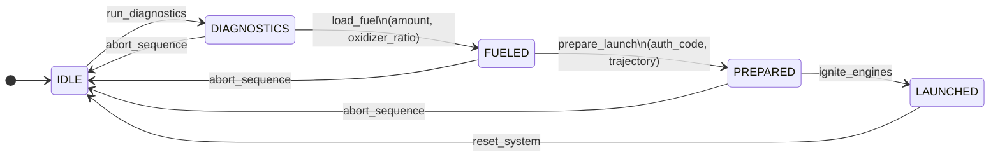

# WebMCP Rocket Launcher

A browser-based demo app that showcases the [WebMCP](https://googlechromelabs.github.io/webmcp-tools/) API — a browser-native interface that exposes structured tools to in-browser AI agents via `navigator.modelContext`.

The app simulates a rocket launch control panel. An AI agent interacts with it by calling WebMCP tools to progress a rocket through its launch sequence.

## Requirements

- **Chrome 146+** with `chrome://flags/#enable-webmcp-testing` set to **Enabled**
- [Model Context Tool Inspector Extension](https://googlechromelabs.github.io/webmcp-tools/) for manual tool testing and agent interaction

## Getting Started

```bash
npm install
npm run dev
```

Open the URL printed by Vite in Chrome. The page displays the rocket panel and a live tool call log on the right.

## Tool Registration Modes

The app supports two WebMCP registration strategies, selectable via a `?mode=` query parameter:

| Mode | URL | Behavior |
|---|---|---|
| **Static** (default) | `/?mode=static` | All four tools registered up-front, always visible to the agent |
| **Dynamic** | `/?mode=dynamic` | Only the tools valid for the current state are registered; the tool list updates on every state change |

## State Machine

The rocket system has three states. Tools drive every transition:



### States

| State | Meaning |
|---|---|
| `IDLE` | System at rest, ready to be prepared |
| `DIAGNOSTICS` | System checks completed, ready for propellants |
| `FUELED` | Propellants loaded, ready for final launch prep |
| `PREPARED` | Trajectory set, engines armed, awaiting ignition |
| `LAUNCHED` | Rocket in flight |

### Tools

| Tool | Valid from | Transition | Notes |
|---|---|---|---|
| `get_page_state` | Any | None (read-only) | Returns current status and fuel level |
| `calculate_fuel` | Any | None | Returns fuel/oxidizer ratio for a given destination |
| `run_diagnostics` | `IDLE` | `IDLE → DIAGNOSTICS` | Prerequisite for fueling |
| `load_fuel` | `DIAGNOSTICS` | `DIAGNOSTICS → FUELED` | Requires `amount` and `oxidizer_ratio` |
| `prepare_launch` | `FUELED` | `FUELED → PREPARED` | Requires `auth_code` (ask the user) and `trajectory` |
| `ignite_engines` | `PREPARED` | `PREPARED → LAUNCHED` | Registered in static mode but returns an error if called earlier in the sequence |
| `abort_sequence` | Active Sequence | `* → IDLE` | Aborts a launch sequence and resets |
| `reset_system` | Any | `* → IDLE` | Resets system entirely |

> **Auth code:** `prepare_launch` requires a 4-digit authorization code displayed on the page. The agent must ask the user for it — it must never be guessed.

## Architecture

- **Vite + TypeScript** — no framework, vanilla JS
- **`src/state.ts`** — state machine (pure functions, no side effects)
- **`src/tools/execute.ts`** — shared `execute()` handlers for all tools
- **`src/tools/static.ts`** — registers all tools once on load
- **`src/tools/dynamic.ts`** — subscribes to state and re-registers tools on every transition
- **`src/ui.ts`** — renders the rocket panel and tool call log; subscribes to state changes

All tool logic runs entirely in the browser — there is no backend server.

## Development

```bash
npm run test          # run unit tests (Vitest)
npm run test:watch    # run tests in watch mode
npm run build         # type-check + build to dist/
npm run format        # format with Prettier
```

## License

Apache-2.0 — Copyright 2026 Google LLC
